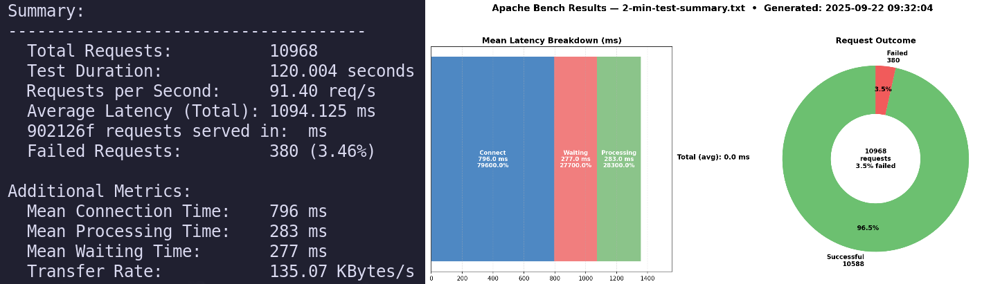

# 🚀 AB Quick Reporter

<div align="center" style="margin-bottom:24px;">
  
</div>

<br>

<div align="center">
  <em>The simplest way to turn Apache Bench results into instant insights and beautiful charts.</em>
</div>

<br>

<div align="center" style="margin-bottom:16px;">
  <!-- Using a simple blue badge for MIT License -->
  
</div>

## ✨ Features

- **Easy to Use:** Simple commands and scripts—no complicated setup.
- **Automated Summaries:** Parse and summarize Apache Bench output in seconds.
- **Instant Visualizations & Export:** Generate beautiful, shareable charts (requests/sec, latency, and more) for reports and presentations.
- **Simplified Charts:** Easy-to-understand visualizations make performance data clear for everyone.

> **🧠 All scripts in this project were generated with the help of AI.**

## ⚡️ Quick Start

### 1. Install Requirements

AB Quick Reporter requires **Python 3.10+** and **matplotlib**.

#### Install matplotlib with apt (system-wide):

```bash
sudo apt update
sudo apt install python3-matplotlib
```

<details>
<summary><strong>Or use pip (recommended: inside a virtual environment)</strong></summary>

```bash
python3 -m venv venv
source venv/bin/activate
pip install matplotlib
```
</details>

### 2. Run Apache Bench

Benchmark your server and save the output:

```bash
ab -n 100 -c 5 https://example.com/ > ab-result.txt
```

### 3. Summarize Results

Make the shell script executable:

```bash
sudo chmod +x summary.sh
```

Then run it to extract the summary:

```bash
./summary.sh ab-result.txt > ab-summary.txt
```

### 4. Generate Charts

Turn your summary into a beautiful visualization:

```bash
python3 charts.py ab-summary.txt
```

- This script will generate image files (e.g., `ab-results.png`) with clear, informative charts using matplotlib.

## 📄 License

This project is licensed under the [MIT License](LICENSE).

<p align="center">
  <b>:star: Found this useful? Star the repo to show your support!</b>
</p>
